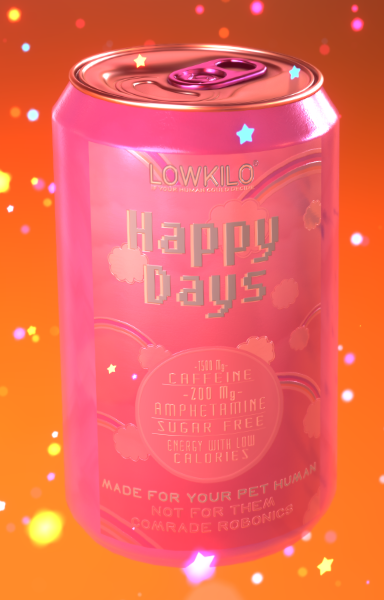

# Lowkilo theme

> ## 
Wordpress-teema kirjoitettuna PHP:lla ja SASSilla, käytetty myös JQuerya ja JavaScriptiä. 

>
> 

Tämä teema on peräisin koodausinnostukseni alkutaipaleelta. Tehdessäni teemaa katsoin tutoriaalia ja yritin samalla myös kokeilla luoda omia juttuja sivuille, sekä tehdä ulkoasusta mahdollisimman omannäköiseni.

Sivusto oli sisällöltään fiktiivisen yrityksen markkinointisivu, jossa mainostettiin apokalyptistä "Lowkilo"-tuotelinjaa joka samalla parodioi oikeasti olemassaolevaa "Low-hilo"-tuotetta. Tuotteet oli suunnattu roboteille/tekoälyille jotka omistivat ihmislemmikkejä, joille oli tullut masennusta, syömishäiriöitä tai muita mielenterveysongelmia, joita koneiden oli vaikea ymmärtää. Tuotelinjassa oli erilaisia energiajuomia joihin oli lisätty vitamiineja ja erilaisia psykoaktiivisia yhdisteitä, jotta robotit saisivat lemmikkinsä takaisin kuntoon.

Backendin kanssa painin muistaakseni paljon. Teeman pohjalla taisi olla mySQL-tietokanta.Wordpress-teemaani sai tehtyä oman käyttäjän, ja se toimi myös CRUD-appmaisesti, käyttäjä pystyi luomaan muistilappuja ja etsimään sivustolta sisältöjä "search" hakupalkista.

Tutoriaaliin (joka oli maksullinen) kuului mukana tullut SiteGround-hostauspalvelu. SiteGroundin myöntämä ilmainen hostausaika on jo ajat sitten loppunut, joten en voi valitettavasti enää esitellä tätä kummallista tekelettä muuta kuin näin koodin muodossa.
